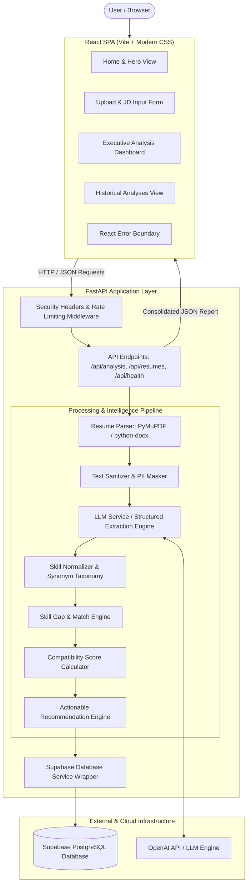
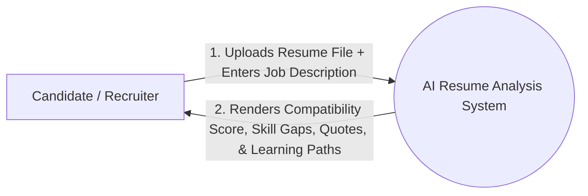
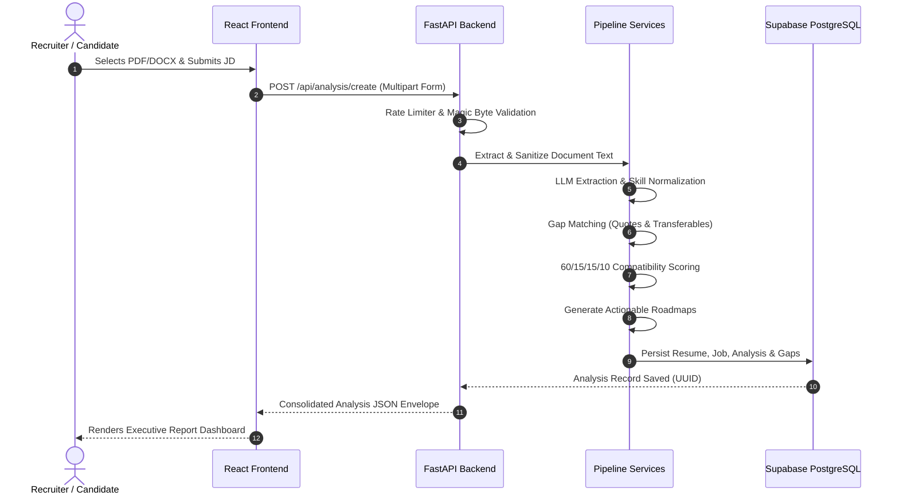
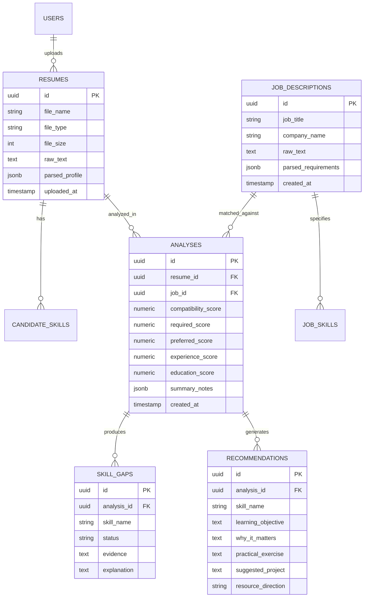

# Academic Project Report: AI-Powered Resume Analysis & Skill Gap Detection System

---

## Abstract

In modern recruitment and talent acquisition, traditional Applicant Tracking Systems (ATS) rely primarily on rudimentary keyword matching. This legacy approach suffers from severe limitations: it is susceptible to "keyword stuffing", fails to recognize synonymy and related competencies (e.g., recognizing that proficiency in Flask or Django indicates strong Python web development capabilities), lacks explainability, and offers zero constructive feedback to candidates on how to close identified skill gaps.

This project presents an **AI-Powered Resume Analysis API and Interactive Recruiter Dashboard with Explainable Skill Gap Detection**. Built using a decoupled client-server architecture with **FastAPI (Python 3.11+)**, **React.js (Vite)**, and **Supabase (PostgreSQL with Row-Level Security)**, the system extracts unstructured resume text from digital PDF and DOCX files, performs deterministic text sanitization, normalizes skills against a hierarchical taxonomy, and executes structured entity extraction via Large Language Models (LLMs).

A transparent, mathematically formulated **60/15/15/10 weighted scoring algorithm** calculates compatibility across Required Skills, Preferred Skills, Experience Alignment, and Educational Background. Crucially, the system introduces an **Explainability Engine** that pairs every matched skill with exact textual evidence quotes extracted directly from the candidate's uploaded document, identifies transferable skills with partial credit, and generates actionable learning roadmaps (including practice exercises and portfolio projects) for missing competencies. Comprehensive defense-in-depth security is enforced via OWASP security headers, an in-memory sliding window rate limiter, and PII masking.

---

## Chapter 1: Introduction & Problem Statement

### 1.1 Background
The global hiring landscape handles millions of resumes daily. As organizations scale, automated screening tools have become indispensable. However, legacy systems evaluate candidates purely through boolean keyword searches, creating two critical problems:
1. **False Negatives**: Highly qualified candidates who phrase their experience differently from the exact job description keywords are rejected.
2. **Lack of Explainability & Constructive Feedback**: Rejected applicants receive generic automated rejection emails with no guidance on what skills they lacked or how they could upskill.

### 1.2 Objectives
The primary objectives of this project are:
- To implement dual-format document parsing for PDF (via PyMuPDF/`fitz`) and DOCX (via `python-docx`) with automated scanned-document detection.
- To design a cross-domain skill normalization engine capable of mapping aliases, case variations, and synonyms to canonical competencies.
- To compute a transparent, explainable compatibility score with granular sub-scores.
- To produce verifiable evidence quotes from the uploaded resume for every identified skill match.
- To automatically generate targeted, actionable learning recommendations (objectives, practice drills, project ideas) for identified skill deficiencies.
- To provide a modern, responsive web dashboard with single-click testing capabilities and historical record tracking.

---

## Chapter 2: System Architecture & Data Flow

### 2.1 High-Level Architecture

### 2.2 Data Flow Diagrams (DFD)

#### Level 0: Context Diagram

#### Level 1: Detailed Functional Flow

---

## Chapter 3: Database & Relational Design

The database is built on **PostgreSQL (Supabase)** and enforces Row-Level Security (RLS) with performance indexes on temporal and foreign key columns.

---

## Chapter 4: Mathematical Formulation & Scoring Algorithm

The overall candidate compatibility score $S_{\text{overall}}$ is a weighted linear combination bounded between $0.00\%$ and $100.00\%$:

$$S_{\text{overall}} = w_{\text{req}} \cdot S_{\text{req}} + w_{\text{pref}} \cdot S_{\text{pref}} + w_{\text{exp}} \cdot S_{\text{exp}} + w_{\text{edu}} \cdot S_{\text{edu}}$$

Subject to:
$$w_{\text{req}} + w_{\text{pref}} + w_{\text{exp}} + w_{\text{edu}} = 1.00$$

Where default weights are configured as:
* $w_{\text{req}} = 0.60$ (Mandatory Required Skills Weight)
* $w_{\text{pref}} = 0.15$ (Preferred / Bonus Skills Weight)
* $w_{\text{exp}} = 0.15$ (Work Experience Alignment Weight)
* $w_{\text{edu}} = 0.10$ (Educational Background Weight)

### 4.1 Skill Credit & Transferability Function
For each required skill $k \in K_{\text{req}}$:
$$c(k) = \begin{cases} 
1.0 & \text{if } k \in S_{\text{candidate}} \quad (\text{Exact Canonical Match}) \\
0.5 & \text{if } \exists s \in S_{\text{candidate}} \text{ s.t. } s \text{ is related to } k \quad (\text{Transferable Skill}) \\
0.0 & \text{otherwise} \quad (\text{Missing Gap})
\end{cases}$$

Then the required skill sub-score is:
$$S_{\text{req}} = \left( \frac{\sum_{k \in K_{\text{req}}} c(k)}{|K_{\text{req}}|} \right) \times 100$$

---

## Chapter 5: Security & Privacy Architecture

The system adheres to modern secure application design:
1. **OWASP Defensive Headers**: Injected via `SecurityHeadersMiddleware`:
   * `X-Content-Type-Options: nosniff`
   * `X-Frame-Options: DENY`
   * `X-XSS-Protection: 1; mode=block`
   * `Referrer-Policy: strict-origin-when-cross-origin`
   * Server signature stripping.
2. **Sliding Window Rate Limiter**:
   * Per-client IP sliding window tracking.
   * Capped at 100 req/min for read endpoints and 20 req/min for heavy AI analysis endpoints.
   * Standard `HTTP 429 Too Many Requests` with `Retry-After` header.
3. **PII Masking**:
   * Email and telephone identifiers are automatically masked (`mask_email`, `mask_phone`) before logging to terminal or crash logs.
4. **Client-Side Error Boundary**:
   * React ErrorBoundary intercepts UI render exceptions, preventing application crashes and offering a 1-click diagnostic recovery screen.

---

## Chapter 6: Verification & Test Results

The backend includes a comprehensive automated testing suite executed via Pytest:
* **Total Automated Tests**: 53 test cases
* **Passing Rate**: 100% (53 / 53 passed)
* **Execution Time**: ~7.44s
* **Coverage Domains**:
  1. Root & Health Diagnostics (`test_health.py`)
  2. File Security & Magic Byte Validation (`test_file_validation.py`)
  3. PDF/DOCX Parser & Scanned PDF Detection (`test_parser.py`)
  4. Taxonomy Normalization & Alias Resolution (`test_normalization.py`)
  5. LLM Structured Extraction & Multi-domain Fallbacks (`test_llm_service.py`)
  6. Job Description Requirement Extraction (`test_job_analysis.py`)
  7. Explainable Skill Gap Engine with Text Quotes (`test_skill_gap.py`)
  8. Configurable Scoring Algorithm & Transferable Credits (`test_scoring.py`)
  9. Actionable Learning Roadmap Generator (`test_recommendations.py`)
  10. Supabase Database Service & Offline Fallbacks (`test_database.py`)
  11. End-to-End Analysis Orchestration (`test_analysis_pipeline.py`)
  12. OWASP Security, Rate Limiting & PII Masking (`test_security.py`)

---

## Chapter 7: Conclusion & Future Scope

This project successfully demonstrates that modern recruitment automation can be both **highly intelligent and completely transparent**. By replacing black-box keyword filtering with semantic normalization, quote-verified evidence extraction, and actionable upskilling recommendations, the system bridges the gap between hiring managers and prospective candidates.

### Future Scope:
- Audio/Video resume transcription via Whisper API.
- Direct automated scheduling integration with calendar APIs (Google Calendar / Outlook).
- Multilingual resume parsing across global languages.
